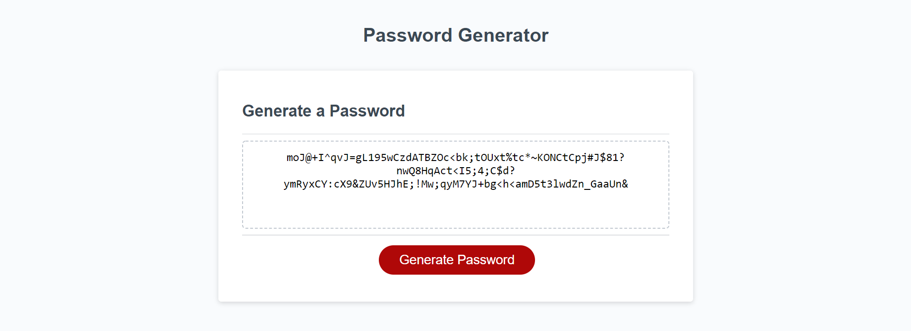

# password-generator

Has a site ever told you that your password was too weak or that it did not satisfy certain criteria? Look no further than this password generator which will give you a randomized password containing upper to lowercase letters, numbers and special characters! The choice is yours as to what you want to include in the password. Now websites will never say your password is weak, we only create strong passwords around these parts.

## Getting Started

Click the deployed link below to see the actual site! Specify the conditions you want the password to have after going through the prompts after clicking the "generate password" button!

## Built With

* [HTML](https://developer.mozilla.org/en-US/docs/Web/HTML)
* [CSS](https://developer.mozilla.org/en-US/docs/Web/CSS)
* [Git](https://git-scm.com/about)
* [Github](https://github.com/)

## Deployed Link

* [See Live Site]()

## Preview

## Authors

* **Eajay Delos Santos** 

    - [Link to Github](https://github.com/EajayD)
    - [Link to LinkedIn](https://www.linkedin.com/in/eajay-delos-santos-912950214/)

## Acknowledgments

* i'd like to thank my classmates once again, talking through different thought processes of how to approach this certain assignment allowed me to get an idea of how I wanted to approach it. Also going a little more in depth of certain functions of javascript and the many ways you can write something and still get to the same solution.
* w3schools for grabbing some string methods and the pop up box method.
